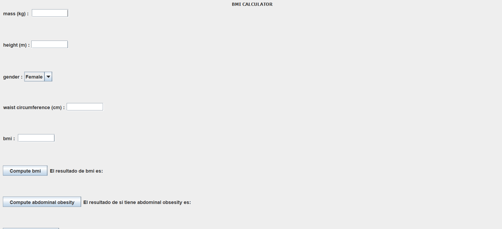

# BMI calculator
A biomedical calculator for the body mass index (BMI) and other parameters.

Firstly, test for the bmi method are defined. Considering the result of the function bmi it is developed the following tests:

1.	For specific inputs (mass and height) the result from the function should be equal to the actual bmi 
	and should not be for incorrect bmi (we try this adding 1 to the correct solution).
	
2.	This test check that the data (height or mass) is not null.

3.	This test check that the data (height or mass) is not negative.

4.	This test check that the data (height or mass) is in range. For the limits, it was looked for the maximum and minimum height and mass. 

5.	For different inputs the result from the function cannot be 0. I test this checking that bmi is not equal to 0.

6.	For different inputs the result from the function cannot be negative. I test that checking that bmi/bmi
	is not equal to -1. 

Secondly, test for category function are defined. In this case, parameterized test are used for each category.
With this type of test we write less code as it allows us to associate itself with parameters and pass them through a variable.

7.	For a standard value, such as 10, and the limits 18.4, the test check that the function return underweight.

8.	For a standard value, such as 20, and the limits 18.5 and 24.9, the test check that the function return normal. 

9.	For a standard value, such as 28, and the limit 25.0 and 29.9, the test check that the function return overweight.

10.	For a standard value, such as 60, and the limit 30, the test check that the function return obese. 
  
In addition, for the last 4 test it is checked that function works well when it is given an a bmi value 
which is not in the studied range.

Thirdly, test for abdominalObesity function are defined. Here, it is used parameterized test again, however, it is also checked 
that the limit is not include.

11. For standard values, such as 80.1 and 85, the test check that the woman has abdominalObesity, whereas for the limit value, 80, she does not.

12. For standard values, such as 92.0 and 95, the test check that the man has abdominalObesity, whereas for the limit value, 90, he does not.

13. This test check that the gender is correctly introduce (F or M).

## Upload use case diagram as an image

## Use case

USE CASE: Determine if a person has abdominal obsesity

Primary Actor: User

Scope: bmi calculator ("bmicalc")

Level: User goal

Stakerholders and Interests:

User - want to do the operation of knowing if somebody has or not abdominal obsesity

Precondition: the gender and waist circumference measurement are correctly introduced

Minimal guarantee: the user get the result of the operation as true or false

Trigger: select the operation "Determine if a person has abdominal obsesity"

Main success scenario:

1. User introduce the data (waist circumference measurement and gender as F (female) or M (male))
	 
2. The system confirm and do the operation
	
3. The system return the result of the operation as "true" or "false"
	
Alternate scenario:

1a. Sumitted data is incorrect:the gender is not introduce as F or M
	
1b. The system return an error message
	
1c. back to step 1

## User story and acceptance criteria

Feature:

	As a user
	
	I want to compute the bmi of a given mass and height
	
	So that I can know the result
	
Scenario1: calculating the bmi for possible mass and height

	Given I have a bmi calculator
	
	  and mass is <m>
	  and height is <h>
	  
	When i calculate bmi for possible mass and height
	
	Then the system returns <value>
	
Scenario2: calculating the bmi for impossible mass or height

	Given I have a bmi calculator
	  and mass is <m>
	  and height is <h>
	  
	When i calculate bmi for impossible mass and height
	
	Then the system raises an exception

Feature: 

	As a Woman User
	
	I want to know if I have abdominal obsesity
	
	So that I can keep healthy
	
Scenario: calculating abdominalobesity for possible values

	Given the user is a woman 
	  and her waistCircumference is <n>
	  
	When i calculate abdominalobsesity
	
	Then the system returns for abdominalobsesity <value>

Feature:

	As a nutritionist
	
	I want to know my patient category
	
	So that I can recommend the correct diet
	
Scenario1: calculating category for possible values

	Given the bmi <n>
	
	When i calculate category
	
	Then the system returns for category <value>
	
Scenario2: calculating category for null bmi

	Given the bmi 0
	
	When i calculate category
	
	Then the system raises an exception
	
Scenario3: calculating category for negative bmi

	Given the bmi -5
	
	When i calculate category
	
	Then the system raises an exception

## Graphic Interface

